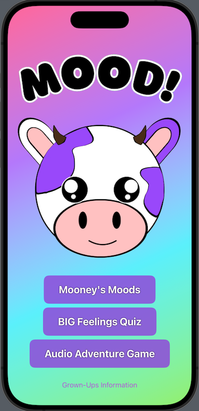
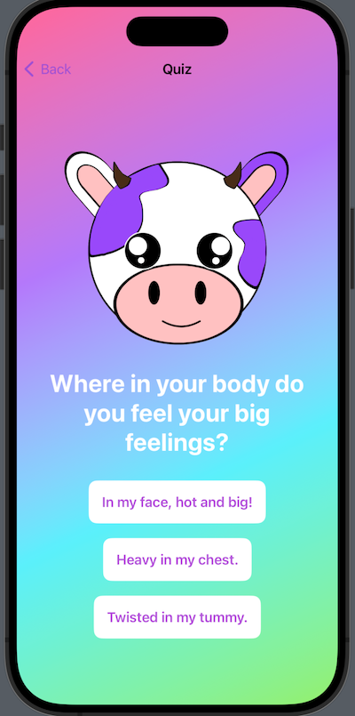
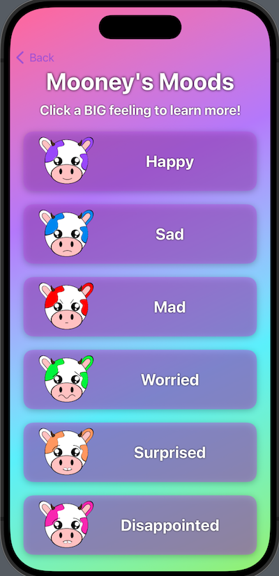
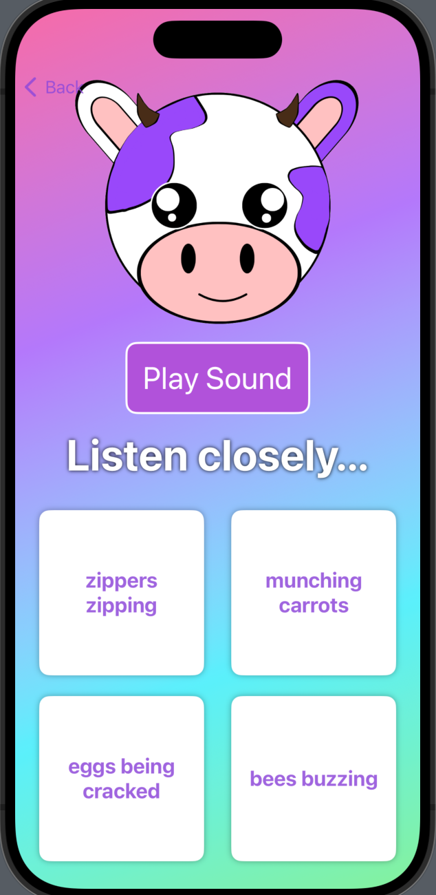

# MOOD
## An emotional regulation app for children & their grown-ups
### By Brianca Knight 
(https://github.com/BriancaKnight)

---
### <u>Jump to section</u>
* <a href="#description">Description</a>
* <a href="#built-with">Built With</a>
* <a href="#known-bugs">Known Bugs</a>
* <a href="#getting-started">Getting Started</a>
* <a href="#stretch-goals">Stretch Goals</a>
* <a href="#license">License</a>
---

## Description
An emotional regulation app for children ages 4-7. This app was created to address the need for emotional regulation tools for children and provide opportunities for kids and their grown-ups to navigate big emotions in a way that is accessible and engaging for young users. By focusing on interactive activities and tools, the app empowers children to understand and manage their emotions while fostering open communication and collaboration between children and their caregivers. The platform aims to offer a safe and supportive space where children can learn emotional intelligence and resilience, laying the foundation for healthier relationships and emotional well-being.

## Technologies Used

## Getting Started

## Prerequisites

### Install XCode 
To view or edit this code, you will need to download apple's code editor Xcode. 

  1) Code Editor Download: [Xcode] (https://developer.apple.com/xcode/)
  2) Click the download most applicable to your OS and system.
  3) Wait for download to complete, then install.

## Setup

### Clone repository
1. Navigate to the [repository](https://github.com/BriancaKnight/MOOD).
2. Click the `Fork` button and you will be taken to a new page where you can give your repository a new name and description. Choose "create fork".
3. Click the `Code` button and copy the url for HTTPS.
4. On your local computer, create a working directory of your choice.
5. In this new directory, via the terminal, type `$ git clone https://github.com/BriancaKnight/MOOD`.
6. Open Xcode and select opening MOOD from the available projects. 
7. View this project by using the built-in preview in Xcode. 

## Known Bugs
* None. 

## Stretch Goals
* Add a "Breathing Exercise" functionality where users can blow out candles, spread the seeds of a dandilion, or make a kite fly in the wind to encourage centering and regulation.
* Add a "Sensory Touch Drawing Board" where users can experience thereputic art with brushes that vibrate on different frequencies.
* Create different age groups for users. Currently the app is aimed to 4-7 year olds, and I would like to create a 8-11, 12-15, and "grown" age classes with more targeted help. 
* Create user profiles to keep track of moods, journals, and artwork made in the drawing board. 

## License
MIT License, see License.md for details

## Screenshots

